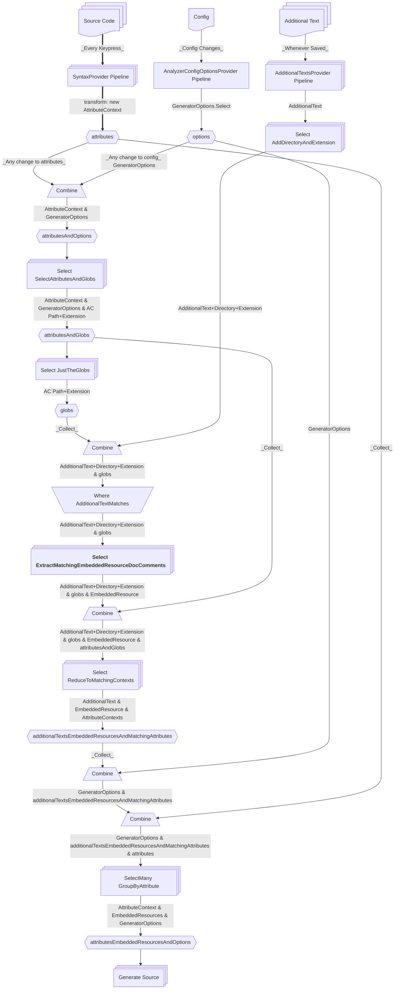

# Mermaid Diagram of Generator Pipelines

```mermaid
flowchart TD
	SC@{ shape: docs, label: "Source Code"} ==>|_Every Keypress_| SPPL
    SPPL@{ shape: procs, label: "SyntaxProvider Pipeline"} ==>|transform: new AttributeContext| AC
    AC{{attributes}} -->|_Any change to attributes_| CACO
    CF@{ shape: doc, label: "Config" } -->|_Config Changes_| CPPL
    CPPL[AnalyzerConfigOptionsProvider Pipeline] -->|GeneratorOptions.Select| GO
    GO{{options}} -->|_Any change to config_ GeneratorOptions| CACO
    CACO[/Combine\] -->|AttributeContext & GeneratorOptions| ACO
    ACO{{attributesAndOptions}} --> SGAC
    SGAC@{ shape: procs, label: "Select SelectAttributesAndGlobs"} -->|AttributeContext & GeneratorOptions & AC Path+Extension| GAC
    GAC{{attributesAndGlobs}} --> GACSG
    GACSG@{ shape: procs, label: "Select JustTheGlobs"} -->|AC Path+Extension| AGB
    AGB{{globs}} -->|_Collect_| ATSPC

	AT@{ shape: docs, label: "Additional Text"} -->|_Whenever Saved_| ATPL
    ATPL@{ shape: procs, label: "AdditionalTextsProvider Pipeline"} -->|AdditionalText| ATSP
    ATSP@{ shape: procs, label: "Select AddDirectoryAndExtension"} -------->|AdditionalText+Directory+Extension| ATSPC
    ATSPC[/Combine\] -->|AdditionalText+Directory+Extension & globs| WATM
    WATM[\Where AdditionalTextMatches/] -->|AdditionalText+Directory+Extension & globs| SERD
    SERD@{ shape: procs, label: "**Select ExtractMatchingEmbeddedResourceDocComments**"} -->|AdditionalText+Directory+Extension & globs & EmbeddedResource| AGER
    GAC -->|_Collect_| AGER
    AGER[/Combine\] -->|AdditionalText+Directory+Extension & globs & EmbeddedResource & attributesAndGlobs| SMR
    SMR@{ shape: procs, label: "Select ReduceToMatchingContexts"} -->|AdditionalText & EmbeddedResource & AttributeContexts| MC
    MC{{additionalTextsEmbeddedResourcesAndMatchingAttributes}} -->|_Collect_| COMC
    GO -->|GeneratorOptions| COMC
    COMC[/Combine\] -->|GeneratorOptions & additionalTextsEmbeddedResourcesAndMatchingAttributes| COMCC
    AC -->|_Collect_| COMCC
    COMCC[/Combine\] -->|GeneratorOptions & additionalTextsEmbeddedResourcesAndMatchingAttributes & attributes| GBAC
    GBAC@{ shape: procs, label: "SelectMany GroupByAttribute"} -->|AttributeContext & EmbeddedResources & GeneratorOptions| CWER
    CWER{{attributesEmbeddedResourcesAndOptions}} --> GS
    GS@{ shape: procs, label: "Generate Source"}
```

